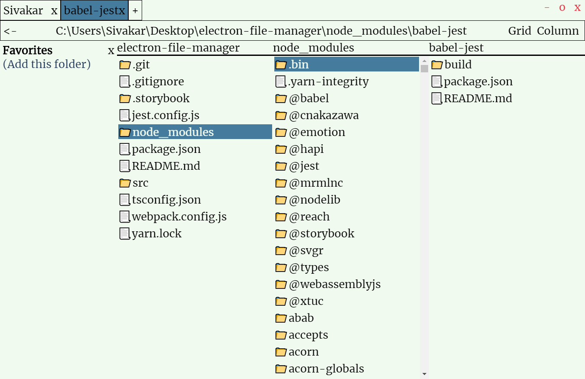
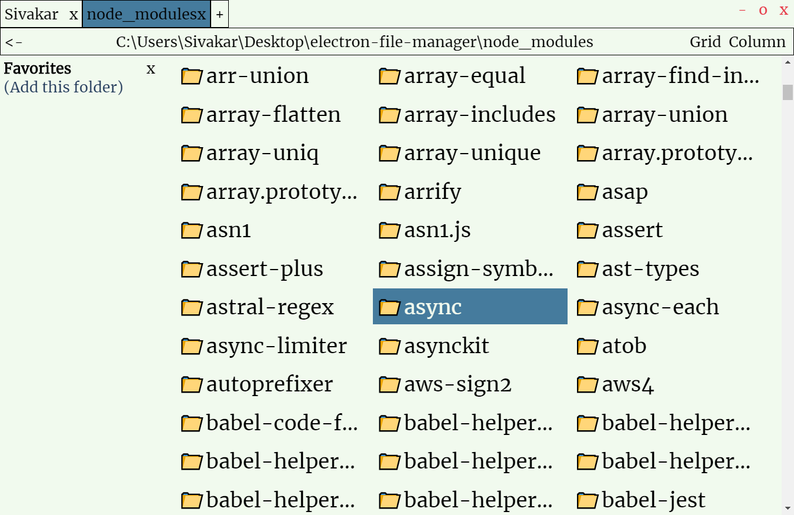
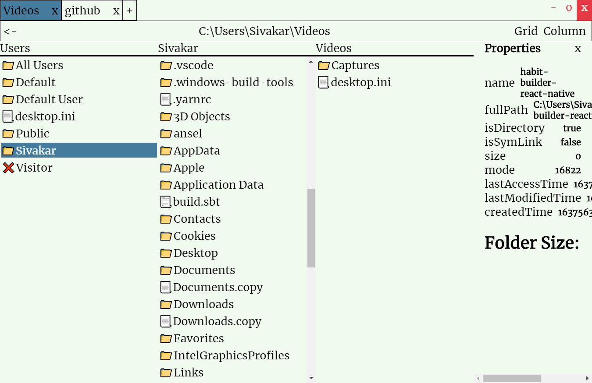

# Elecron File Manager

## To setup
npm install

## To run in development
npm start

## If it stops working,
Use Ctrl + R to reload

## Keyboard Shortcuts
Ctrl+C, Ctrl+X, Ctrl+V: Copy, Cut, Paste
Ctrl+Tab, Ctrl+Shift+Tab: Switch Tabs
Ctrl+T: New Tab
Ctrl+W: Close Tab
Ctrl+F: Toggle Favorites
Ctrl+P: Toggle Properties Panel

## Screenshots

